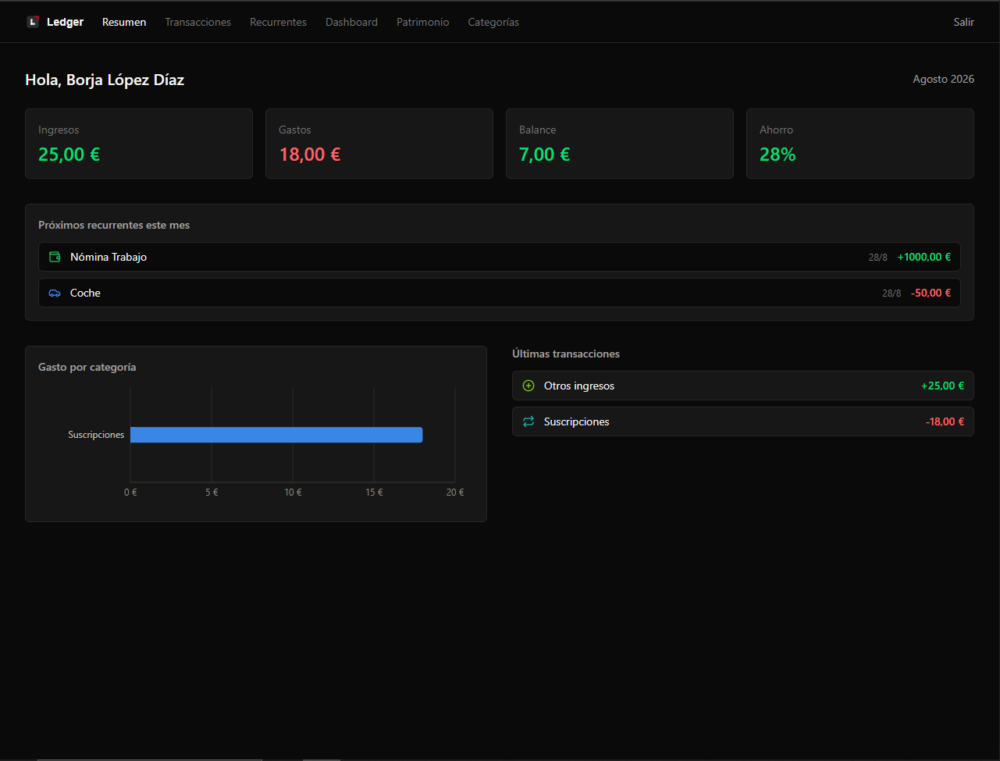
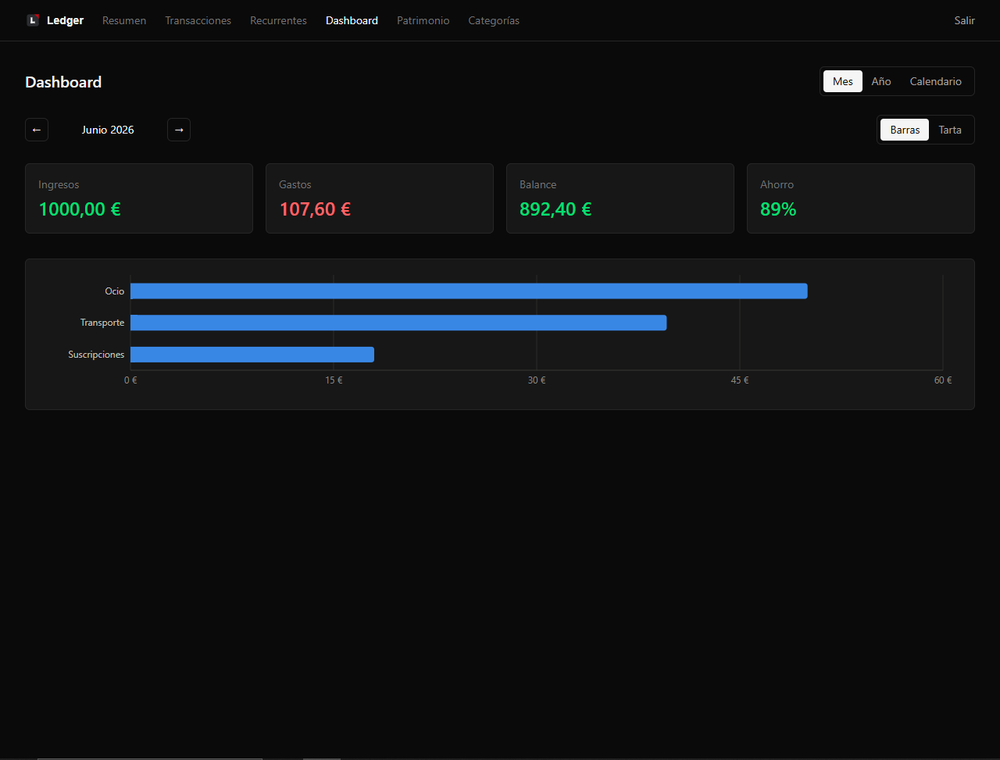
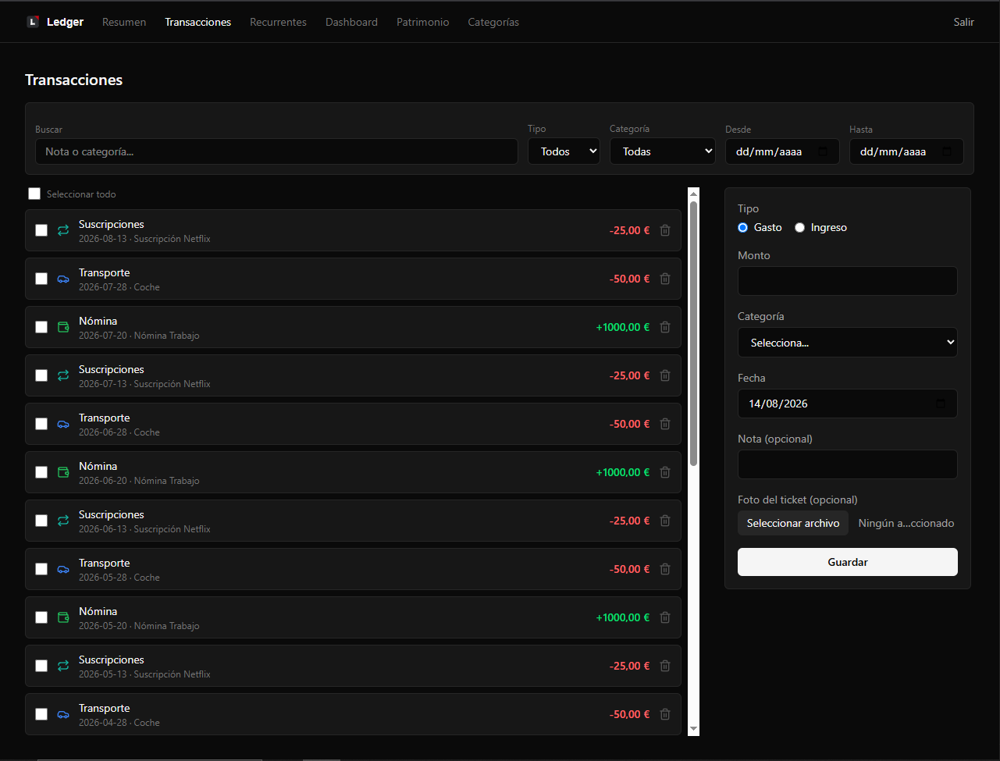
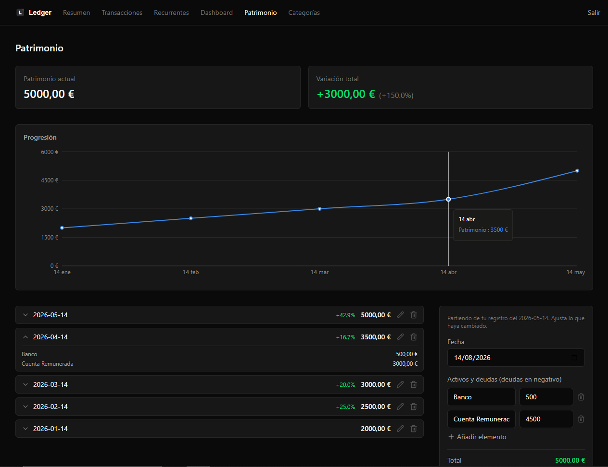
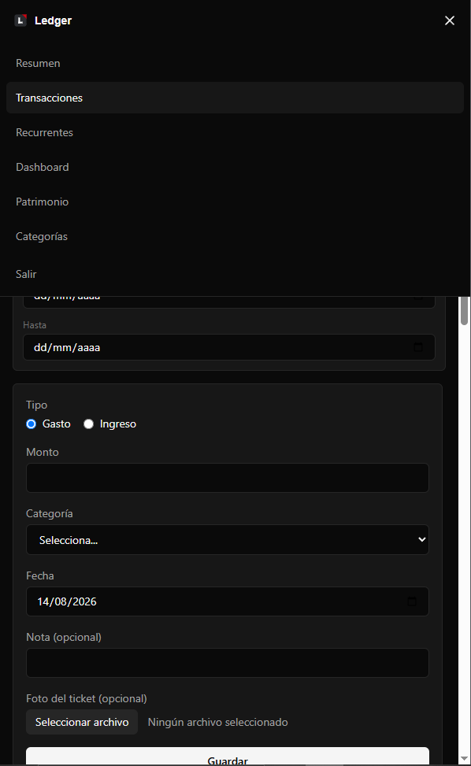

<div align="center">

# 📒 Ledger

**Aplicación de finanzas personales — gastos, ingresos, pagos recurrentes y patrimonio.**

Frontend React 19 + TypeScript sobre una arquitectura serverless: Firebase (Auth,
Firestore, Storage) sustituye por completo al backend.

[](https://react.dev)
[](https://www.typescriptlang.org)
[](https://vite.dev)
[](https://firebase.google.com)
[](https://tailwindcss.com)

</div>

---

## Capturas

<!-- TODO: sustituir por capturas reales en docs/screenshots/ (1280px desktop, 390px móvil). -->

| Resumen | Dashboard |
|---|---|
|  |  |

| Transacciones | Patrimonio |
|---|---|
|  |  |

| Móvil |
|---|
|  |

## Funcionalidades

- **Resumen mensual** — balance, gasto por categoría, porcentaje de ahorro y aviso de recurrentes pendientes del mes en curso.
- **Transacciones** — registro de gastos e ingresos con adjunto de foto de ticket, filtros por texto/tipo/categoría/rango de fechas, selección múltiple con borrado masivo, y modal de detalle con edición.
- **Pagos recurrentes** — periodicidad semanal, mensual o anual; se materializan automáticamente como transacciones reales al abrir la aplicación, sin registro manual mes a mes.
- **Dashboard** — vistas mensual, anual y calendario (mes/semana/año), con gráfico de barras o de tarta intercambiable. La vista calendario muestra marcadores por categoría con desglose al pasar el cursor.
- **Patrimonio** — snapshots periódicos de activos y deudas; cada nuevo registro parte del anterior, reduciendo la entrada de datos a los cambios reales. Incluye variación porcentual entre periodos.
- **Categorías** — configurables por nombre, icono, color y tipo, con un set inicial predefinido.
- **Autenticación** — Google o email/contraseña; los datos quedan aislados por usuario mediante reglas de seguridad de Firestore y Storage.
- **Diseño responsive** — navegación con menú móvil, formularios posicionados antes de las listas para evitar scroll excesivo, sin desbordamiento horizontal.

## Stack técnico

| Capa | Tecnología |
|---|---|
| UI | React 19, TypeScript, Tailwind CSS v4 |
| Enrutado | React Router 7 |
| Datos remotos | Firebase (Auth, Firestore, Storage) vía TanStack Query |
| Estado global | Zustand |
| Formularios | React Hook Form + Zod |
| Visualización de datos | Recharts |
| Animación | Framer Motion |
| Iconografía | Lucide |
| Build | Vite |

La aplicación no requiere backend propio: toda la lógica de negocio corre en el
cliente, con Firestore y Storage como única capa de persistencia. Las reglas de
seguridad restringen cada documento al `uid` del usuario autenticado.

## Puesta en marcha

```bash
npm install
cp .env.example .env
npm run dev
```

`.env` debe completarse con la configuración de un proyecto de Firebase que tenga
**Authentication** (Email/Password y/o Google), **Firestore** y **Storage**
habilitados. Las reglas de seguridad se encuentran en `firestore.rules` y
`storage.rules`, y deben publicarse desde la consola de Firebase o vía
`firebase deploy`.

## Despliegue

El proyecto está configurado para Netlify (`netlify.toml`, incluye el redirect
necesario para el enrutado de React Router). Las variables de entorno
(`VITE_FIREBASE_*`) se definen en el panel de Netlify, no en `.env`. El dominio
de producción debe añadirse en **Firebase → Authentication → Settings →
Authorized domains** para que el inicio de sesión con Google funcione en ese
entorno.

## Estructura

```
src/
  features/   # un directorio por dominio (transactions, recurring, networth...)
  routes/     # layout, rutas protegidas, listener de auth
  store/      # estado global (zustand)
  lib/        # cliente de Firebase, query client
  types/      # modelo de datos compartido
```

---

<div align="center">

Desarrollado por [Borja López Díaz](https://github.com/BorjaLopz)

</div>
